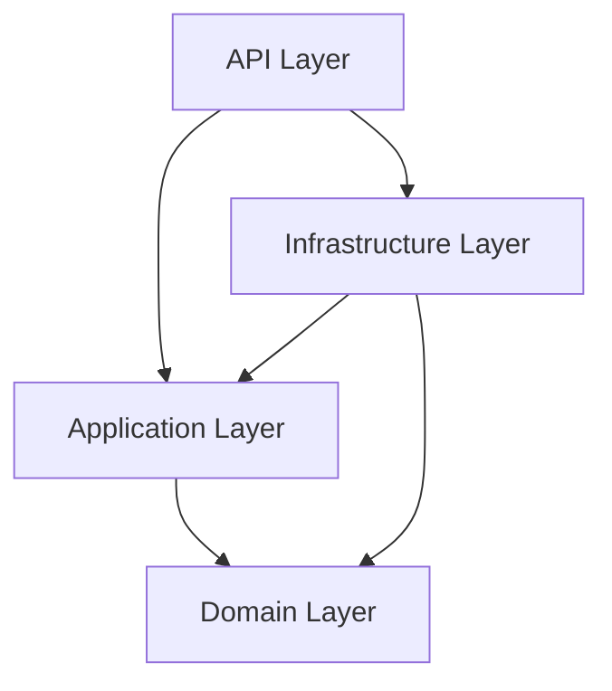

# /generate-docs - API Documentation Generator

Generate comprehensive API documentation including OpenAPI specs, module documentation, and developer guides.

## Usage
```
/generate-docs <type> [options]
```

Types:
- `api` - Generate OpenAPI/Swagger documentation
- `modules` - Generate module/namespace documentation
- `readme` - Generate or update project README
- `changelog` - Generate changelog from git history
- `all` - Generate all documentation types

Options:
- `--output <path>` - Output directory (default: `docs/`)
- `--format <md|html|json>` - Output format (default: md)
- `--include-private` - Include internal/private members
- `--story <ACF-###>` - Link to story ID

## Instructions

When invoked:

### API Documentation (`/generate-docs api`)

#### 1. Extract OpenAPI Specification

```bash
# Generate OpenAPI JSON from running application
dotnet swagger tofile --output docs/api/openapi.json ./src/ProjectName.API/bin/Debug/net8.0/ProjectName.API.dll v1

# Or use Swashbuckle CLI
dotnet tool install -g Swashbuckle.AspNetCore.Cli
swagger tofile --output openapi.json ProjectName.API.dll v1
```

#### 2. Generate API Reference

```markdown
# API Reference

## Overview

**Base URL**: `https://api.example.com/v1`
**Version**: 1.0.0
**Authentication**: Bearer JWT Token

## Authentication

All API requests require authentication via JWT Bearer token:

```http
Authorization: Bearer <your-token>
```

### Obtaining a Token

```http
POST /api/auth/login
Content-Type: application/json

{
  "email": "user@example.com",
  "password": "your-password"
}
```

Response:
```json
{
  "accessToken": "eyJhbG...",
  "refreshToken": "dGhpcyBpcyBh...",
  "expiresIn": 900
}
```

---

## Endpoints

{{#each controllers}}
### {{name}}

{{description}}

{{#each endpoints}}
#### {{method}} {{path}}

{{summary}}

**Authorization**: {{auth}}

**Parameters**:
| Name | In | Type | Required | Description |
|------|----|----- |----------|-------------|
{{#each parameters}}
| {{name}} | {{in}} | {{type}} | {{required}} | {{description}} |
{{/each}}

**Request Body**:
```json
{{requestBodyExample}}
```

**Responses**:
| Code | Description |
|------|-------------|
{{#each responses}}
| {{code}} | {{description}} |
{{/each}}

**Example**:
```bash
curl -X {{method}} '{{baseUrl}}{{path}}' \
  -H 'Authorization: Bearer <token>' \
  -H 'Content-Type: application/json' \
  -d '{{requestBodyExample}}'
```

{{/each}}
{{/each}}

---

## Models

{{#each models}}
### {{name}}

{{description}}

| Property | Type | Required | Description |
|----------|------|----------|-------------|
{{#each properties}}
| {{name}} | {{type}} | {{required}} | {{description}} |
{{/each}}

**Example**:
```json
{{example}}
```

{{/each}}

---

## Error Codes

| Code | Name | Description |
|------|------|-------------|
| 400 | Bad Request | Invalid request parameters |
| 401 | Unauthorized | Missing or invalid authentication |
| 403 | Forbidden | Insufficient permissions |
| 404 | Not Found | Resource not found |
| 409 | Conflict | Resource conflict (duplicate) |
| 422 | Unprocessable Entity | Validation failed |
| 500 | Internal Server Error | Server error |

### Error Response Format

```json
{
  "type": "https://tools.ietf.org/html/rfc7231#section-6.5.1",
  "title": "Bad Request",
  "status": 400,
  "traceId": "00-abc123-def456-00",
  "errors": {
    "Email": ["The Email field is required."]
  }
}
```

---

## Rate Limiting

API requests are rate limited:
- **Anonymous**: 100 requests/hour
- **Authenticated**: 1000 requests/hour

Rate limit headers:
```http
X-RateLimit-Limit: 1000
X-RateLimit-Remaining: 999
X-RateLimit-Reset: 1640995200
```

---

## Pagination

List endpoints support pagination:

```http
GET /api/orders?page=1&pageSize=20
```

Response includes pagination metadata:
```json
{
  "items": [...],
  "page": 1,
  "pageSize": 20,
  "totalCount": 150,
  "totalPages": 8,
  "hasNextPage": true,
  "hasPreviousPage": false
}
```
```

### Module Documentation (`/generate-docs modules`)

#### 1. Scan Project Structure

```bash
# Find all namespaces
grep -rh "^namespace" src/ --include="*.cs" | sort -u

# Find all public classes
grep -rh "public class\|public interface\|public record\|public enum" src/ --include="*.cs"
```

#### 2. Generate Module Documentation

```markdown
# Module Documentation

## Solution Structure

```
{{SolutionName}}/
├── src/
│   ├── {{ProjectName}}.Domain/
│   ├── {{ProjectName}}.Application/
│   ├── {{ProjectName}}.Infrastructure/
│   └── {{ProjectName}}.API/
└── tests/
    ├── {{ProjectName}}.UnitTests/
    ├── {{ProjectName}}.IntegrationTests/
    └── {{ProjectName}}.ArchitectureTests/
```

---

## Domain Layer

**Project**: `{{ProjectName}}.Domain`
**Purpose**: Core business logic, entities, and domain events

### Entities

{{#each entities}}
#### {{name}}

{{description}}

**File**: `Entities/{{name}}.cs`

```csharp
{{codeSnippet}}
```

**Properties**:
| Name | Type | Description |
|------|------|-------------|
{{#each properties}}
| {{name}} | {{type}} | {{description}} |
{{/each}}

**Methods**:
{{#each methods}}
- `{{signature}}`: {{description}}
{{/each}}

{{/each}}

### Value Objects

{{#each valueObjects}}
#### {{name}}

{{description}}

**File**: `ValueObjects/{{name}}.cs`

{{/each}}

### Domain Events

{{#each domainEvents}}
#### {{name}}

Raised when: {{trigger}}

**Properties**: {{properties}}

{{/each}}

### Repository Interfaces

{{#each repositories}}
#### {{name}}

**File**: `Repositories/{{name}}.cs`

**Methods**:
{{#each methods}}
- `{{signature}}`
{{/each}}

{{/each}}

---

## Application Layer

**Project**: `{{ProjectName}}.Application`
**Purpose**: Use cases, CQRS handlers, DTOs, validators

### Commands

{{#each commands}}
#### {{name}}

**Handler**: `{{handler}}`
**Purpose**: {{purpose}}

**Input**:
```csharp
{{inputType}}
```

**Output**: `{{outputType}}`

{{/each}}

### Queries

{{#each queries}}
#### {{name}}

**Handler**: `{{handler}}`
**Purpose**: {{purpose}}

**Input**: `{{inputType}}`
**Output**: `{{outputType}}`

{{/each}}

### Validators

{{#each validators}}
#### {{name}}

Validates: `{{targetType}}`

**Rules**:
{{#each rules}}
- {{rule}}
{{/each}}

{{/each}}

---

## Infrastructure Layer

**Project**: `{{ProjectName}}.Infrastructure`
**Purpose**: Data access, external services, implementations

### DbContext

**File**: `Persistence/ApplicationDbContext.cs`

**Entities Configured**:
{{#each dbSets}}
- `DbSet<{{entity}}>` - {{table}}
{{/each}}

### Repository Implementations

{{#each repositoryImpls}}
#### {{name}}

Implements: `{{interface}}`

{{/each}}

### External Services

{{#each externalServices}}
#### {{name}}

**Purpose**: {{purpose}}
**Configuration**: `{{configSection}}`

{{/each}}

---

## API Layer

**Project**: `{{ProjectName}}.API`
**Purpose**: HTTP endpoints, middleware, DI configuration

### Controllers

{{#each controllers}}
#### {{name}}

**Route**: `{{route}}`
**Authorization**: {{authorization}}

**Endpoints**:
{{#each endpoints}}
- `{{method}} {{path}}` - {{description}}
{{/each}}

{{/each}}

### Middleware

{{#each middleware}}
#### {{name}}

**Purpose**: {{purpose}}
**Order**: {{order}}

{{/each}}

---

## Dependency Graph


```

### README Generation (`/generate-docs readme`)

```markdown
# {{ProjectName}}

{{description}}

## Features

{{#each features}}
- {{feature}}
{{/each}}

## Tech Stack

- .NET {{dotnetVersion}}
- {{database}}
- {{otherTech}}

## Getting Started

### Prerequisites

- .NET SDK {{dotnetVersion}}
- Docker (optional)
- {{otherPrereqs}}

### Installation

```bash
# Clone the repository
git clone {{repoUrl}}
cd {{projectName}}

# Restore dependencies
dotnet restore

# Run database migrations
dotnet ef database update -p src/{{ProjectName}}.Infrastructure -s src/{{ProjectName}}.API

# Run the application
dotnet run --project src/{{ProjectName}}.API
```

### Configuration

Create `appsettings.Development.json`:

```json
{
  "ConnectionStrings": {
    "DefaultConnection": "Host=localhost;Database={{dbName}};Username=postgres;Password=postgres"
  },
  "Jwt": {
    "Secret": "your-256-bit-secret-key-here",
    "Issuer": "https://localhost:5001",
    "Audience": "https://localhost:5001"
  }
}
```

## Project Structure

```
{{projectStructure}}
```

## API Documentation

API documentation is available at `/swagger` when running in Development mode.

See [API Reference](docs/api/README.md) for detailed endpoint documentation.

## Testing

```bash
# Run all tests
dotnet test

# Run with coverage
dotnet test --collect:"XPlat Code Coverage"

# Run specific test project
dotnet test tests/{{ProjectName}}.UnitTests
```

## Contributing

See [CONTRIBUTING.md](CONTRIBUTING.md) for contribution guidelines.

## License

{{license}}
```

### Changelog Generation (`/generate-docs changelog`)

```bash
# Extract commits since last tag
git log $(git describe --tags --abbrev=0)..HEAD --oneline

# Group by type
git log --format="%s" | grep -E "^(feat|fix|docs|refactor|test|chore):"
```

```markdown
# Changelog

All notable changes to this project will be documented in this file.

The format is based on [Keep a Changelog](https://keepachangelog.com/en/1.0.0/),
and this project adheres to [Semantic Versioning](https://semver.org/spec/v2.0.0.html).

## [Unreleased]

### Added
{{#each unreleasedFeatures}}
- {{description}} ({{storyId}})
{{/each}}

### Changed
{{#each unreleasedChanges}}
- {{description}}
{{/each}}

### Fixed
{{#each unreleasedFixes}}
- {{description}} ({{storyId}})
{{/each}}

## [{{version}}] - {{date}}

### Added
{{#each features}}
- {{description}} ([{{storyId}}](artifacts/stories/{{storyId}}.md))
{{/each}}

### Changed
{{#each changes}}
- {{description}}
{{/each}}

### Fixed
{{#each fixes}}
- {{description}}
{{/each}}

### Security
{{#each security}}
- {{description}}
{{/each}}

[Unreleased]: {{repoUrl}}/compare/v{{version}}...HEAD
[{{version}}]: {{repoUrl}}/compare/v{{previousVersion}}...v{{version}}
```

## Output Summary

After generation, display:

```markdown
## Documentation Generated

| Type | Files | Location |
|------|-------|----------|
| API Reference | 1 | docs/api/README.md |
| OpenAPI Spec | 1 | docs/api/openapi.json |
| Module Docs | 4 | docs/modules/ |
| README | 1 | README.md |
| Changelog | 1 | CHANGELOG.md |

### Generated Files
- docs/api/README.md (API reference with examples)
- docs/api/openapi.json (OpenAPI 3.0 specification)
- docs/modules/domain.md (Domain layer documentation)
- docs/modules/application.md (Application layer documentation)
- docs/modules/infrastructure.md (Infrastructure layer documentation)
- docs/modules/api.md (API layer documentation)

### Next Steps
1. Review generated documentation for accuracy
2. Add missing descriptions to XML comments
3. Commit documentation: git add docs/ && git commit -m "docs: update API documentation"
```

## Example

```
User: /generate-docs api

Claude: Generating API documentation...

Scanning controllers:
- OrdersController (6 endpoints)
- CustomersController (5 endpoints)
- AuthController (3 endpoints)

Extracting models:
- OrderDto, CreateOrderRequest, OrderResponse
- CustomerDto, CreateCustomerRequest
- LoginRequest, AuthResponse

Generated:
- docs/api/README.md (API reference)
- docs/api/openapi.json (OpenAPI spec)

API documentation generated successfully.
14 endpoints documented across 3 controllers.
```

```
User: /generate-docs all --format md

Claude: Generating all documentation...

[1/4] API Documentation... ✓
[2/4] Module Documentation... ✓
[3/4] README... ✓
[4/4] Changelog... ✓

All documentation generated in docs/

Summary:
- API: 14 endpoints, 12 models
- Modules: 4 layers documented
- README: Updated with current structure
- Changelog: 23 commits processed

Total: 8 files generated
```
