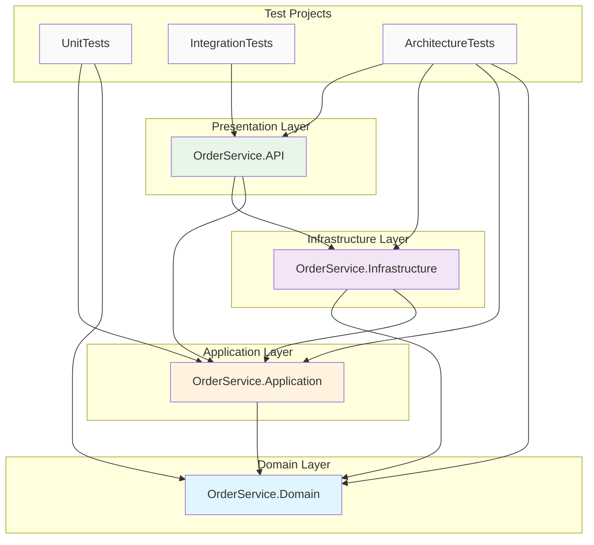

# /dependencies - Dependency Graph Visualization

Analyze and display project dependencies including Clean Architecture layer relationships.

## Usage
```
/dependencies [options]
```

Options:
- `--project <name>` - Analyze specific project (default: current solution)
- `--format <ascii|mermaid|json>` - Output format (default: ascii)
- `--packages` - Include NuGet package dependencies
- `--depth <n>` - Transitive dependency depth (default: 1)
- `--violations` - Only show architecture violations

## Instructions

When invoked:

### 1. Find Solution and Projects

```bash
# Find solution file
find . -name "*.sln" -type f | head -1

# List all projects
dotnet sln list
```

### 2. Analyze Project References

For each `.csproj` file, extract:
- Project references (`<ProjectReference>`)
- Package references (`<PackageReference>`)
- Target framework

```bash
# Extract project references
grep -h "<ProjectReference" **/*.csproj | sed 's/.*Include="\([^"]*\)".*/\1/'

# Extract package references
grep -h "<PackageReference" **/*.csproj
```

### 3. Validate Clean Architecture Rules

**Layer Dependency Rules**:
```
ALLOWED:
- Domain → (nothing)
- Application → Domain
- Infrastructure → Domain, Application
- API → Domain, Application, Infrastructure

VIOLATIONS:
- Domain → Application (Domain must be independent)
- Domain → Infrastructure (Domain must be independent)
- Application → Infrastructure (Application must not know Infrastructure)
- Application → API (Application must not know API)
```

### 4. Generate ASCII Output (Default)

```
================================================================================
                        DEPENDENCY GRAPH: OrderService
================================================================================

CLEAN ARCHITECTURE LAYERS
-------------------------

┌─────────────────────────────────────────────────────────────────────────────┐
│                                    API                                       │
│                         OrderService.API.csproj                              │
│                                                                              │
│  Dependencies:                                                               │
│    → OrderService.Application                                                │
│    → OrderService.Infrastructure                                             │
│    → OrderService.Domain (transitive)                                        │
└─────────────────────────────────────────────────────────────────────────────┘
                                      │
                                      ▼
┌─────────────────────────────────────────────────────────────────────────────┐
│                              INFRASTRUCTURE                                  │
│                     OrderService.Infrastructure.csproj                       │
│                                                                              │
│  Dependencies:                                                               │
│    → OrderService.Application                                                │
│    → OrderService.Domain                                                     │
│                                                                              │
│  Packages:                                                                   │
│    → Npgsql.EntityFrameworkCore.PostgreSQL (8.0.0)                          │
│    → Microsoft.EntityFrameworkCore (8.0.0)                                   │
└─────────────────────────────────────────────────────────────────────────────┘
                                      │
                                      ▼
┌─────────────────────────────────────────────────────────────────────────────┐
│                               APPLICATION                                    │
│                      OrderService.Application.csproj                         │
│                                                                              │
│  Dependencies:                                                               │
│    → OrderService.Domain                                                     │
│                                                                              │
│  Packages:                                                                   │
│    → MediatR (12.2.0)                                                        │
│    → FluentValidation (11.9.0)                                               │
└─────────────────────────────────────────────────────────────────────────────┘
                                      │
                                      ▼
┌─────────────────────────────────────────────────────────────────────────────┐
│                                  DOMAIN                                      │
│                        OrderService.Domain.csproj                            │
│                                                                              │
│  Dependencies: (none - as expected)                                          │
│                                                                              │
│  Packages: (none - as expected)                                              │
└─────────────────────────────────────────────────────────────────────────────┘


TEST PROJECTS
-------------

┌──────────────────────────────────────┐
│        OrderService.UnitTests        │
│  → OrderService.Domain               │
│  → OrderService.Application          │
└──────────────────────────────────────┘

┌──────────────────────────────────────┐
│    OrderService.IntegrationTests     │
│  → OrderService.API                  │
│  → OrderService.Infrastructure       │
└──────────────────────────────────────┘

┌──────────────────────────────────────┐
│   OrderService.ArchitectureTests     │
│  → All projects                      │
└──────────────────────────────────────┘


ARCHITECTURE VALIDATION
-----------------------
✅ Domain has no project dependencies
✅ Application only depends on Domain
✅ Infrastructure depends on Domain + Application
✅ API is composition root

STATUS: All Clean Architecture rules satisfied
```

### 5. Generate Mermaid Output (--format mermaid)



### 6. Generate JSON Output (--format json)

```json
{
  "solution": "OrderService.sln",
  "analyzedAt": "2025-01-20T10:30:00Z",
  "projects": [
    {
      "name": "OrderService.Domain",
      "path": "src/OrderService.Domain/OrderService.Domain.csproj",
      "layer": "Domain",
      "targetFramework": "net8.0",
      "projectReferences": [],
      "packageReferences": []
    },
    {
      "name": "OrderService.Application",
      "path": "src/OrderService.Application/OrderService.Application.csproj",
      "layer": "Application",
      "targetFramework": "net8.0",
      "projectReferences": ["OrderService.Domain"],
      "packageReferences": [
        { "name": "MediatR", "version": "12.2.0" },
        { "name": "FluentValidation", "version": "11.9.0" }
      ]
    }
  ],
  "violations": [],
  "summary": {
    "totalProjects": 7,
    "productionProjects": 4,
    "testProjects": 3,
    "totalPackages": 15,
    "architectureValid": true
  }
}
```

### 7. Show Violations Only (--violations)

When architecture violations are detected:

```
================================================================================
                     ARCHITECTURE VIOLATIONS DETECTED
================================================================================

❌ VIOLATION 1: Domain depends on Application
   File: src/OrderService.Domain/OrderService.Domain.csproj
   Reference: <ProjectReference Include="..\OrderService.Application\..." />

   RULE: Domain layer must have no project dependencies
   FIX: Remove the reference. Move shared code to Domain or create shared kernel.

❌ VIOLATION 2: Application depends on Infrastructure
   File: src/OrderService.Application/OrderService.Application.csproj
   Reference: <ProjectReference Include="..\OrderService.Infrastructure\..." />

   RULE: Application must only depend on Domain
   FIX: Use interfaces in Application, implement in Infrastructure (DI)

================================================================================
                              SUMMARY
================================================================================
Total violations: 2
Projects affected: 2

Run: /dependencies --format mermaid > deps.md
     to generate visual diagram for documentation
```

### 8. Package Dependency Analysis (--packages)

```
================================================================================
                         PACKAGE DEPENDENCIES
================================================================================

SHARED PACKAGES (used by multiple projects)
-------------------------------------------
Microsoft.Extensions.DependencyInjection.Abstractions (8.0.0)
  └─ Used by: Application, Infrastructure, API

FluentValidation (11.9.0)
  └─ Used by: Application, API

LAYER-SPECIFIC PACKAGES
-----------------------
Domain:
  (no packages - clean domain)

Application:
  ├─ MediatR (12.2.0)
  ├─ FluentValidation (11.9.0)
  └─ FluentValidation.DependencyInjectionExtensions (11.9.0)

Infrastructure:
  ├─ Microsoft.EntityFrameworkCore (8.0.0)
  ├─ Npgsql.EntityFrameworkCore.PostgreSQL (8.0.0)
  ├─ Microsoft.EntityFrameworkCore.Design (8.0.0)
  └─ Serilog.AspNetCore (8.0.0)

API:
  ├─ Swashbuckle.AspNetCore (6.5.0)
  ├─ Asp.Versioning.Mvc (8.0.0)
  └─ Microsoft.AspNetCore.Authentication.JwtBearer (8.0.0)

OUTDATED PACKAGES
-----------------
⚠️  MediatR: 12.2.0 → 12.3.0 available
⚠️  Serilog.AspNetCore: 8.0.0 → 8.0.1 available

VULNERABLE PACKAGES
-------------------
✅ No known vulnerabilities detected
```

## Output Summary

At the end of analysis, always provide:

```
================================================================================
                              ANALYSIS COMPLETE
================================================================================

Solution:        OrderService.sln
Projects:        7 (4 production + 3 test)
Packages:        15 unique packages
Framework:       .NET 8.0
Architecture:    ✅ Valid (Clean Architecture)

Quick Commands:
  /dependencies --violations     Check for architecture violations
  /dependencies --packages       Show package dependencies
  /dependencies --format mermaid Generate diagram for docs
```

## Example

```
User: /dependencies

Claude: Analyzing solution dependencies...

Found solution: OrderService.sln
Analyzing 7 projects...

[Generates ASCII dependency graph]

Architecture Status: ✅ All Clean Architecture rules satisfied

- Domain: 0 dependencies (correct)
- Application: 1 dependency → Domain (correct)
- Infrastructure: 2 dependencies → Domain, Application (correct)
- API: 3 dependencies → All layers (correct as composition root)

No violations detected.
```

```
User: /dependencies --violations

Claude: Scanning for architecture violations...

❌ Found 1 violation:

VIOLATION: Application references Infrastructure
  File: src/OrderService.Application/OrderService.Application.csproj
  Line: 12

  This violates the Dependency Rule. Application should not know about
  Infrastructure details. Use dependency injection instead.

  Suggested fix:
  1. Define interface in Application: IEmailService
  2. Implement in Infrastructure: SmtpEmailService
  3. Register in API: services.AddScoped<IEmailService, SmtpEmailService>()
```
